### MERN STACK IMPLEMENTATION
MERN stack consists of the following:

- MongoDB: A document-based, No-SQL database used to store application data in a form of documents.

- ExpressJS: A server side Web Application framework for Node.js.

- ReactJS: A frontend framework developed by Facebook. It is based on JavaScript, used to build User Interface (UI) components.

- Node.js: A JavaScript runtime environment. It is used to run JavaScript on a machine rather than in a browser.

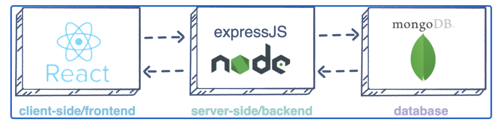

As shown on the illustration above, a user interacts with the ReactJS UI components at the application front-end residing in the browser. This frontend is served by the application backend residing in a server, through ExpressJS running on top of NodeJS.

Any interaction that causes a data change request is sent to the NodeJS based Express server, which grabs data from the MongoDB database if required, and returns the data to the frontend of the application, which is then presented to the user.

### STEP 1 – BACKEND CONFIGURATION

Run the following code:

Ubuntu update:

`sudo apt update`

Upgrade ubuntu:

`sudo apt upgrade`

Get location of Node.js software from Ubuntu repositories

`curl -sL https://deb.nodesource.com/setup_12.x | sudo -E bash -`

Use below code to install Node.js

`sudo apt-get install -y nodejs`

Note that the command above installs both nodejs and npm. NPM is a package manager for Node like apt for Ubuntu, it is used to install Node modules & packages and to manage dependency conflicts.

verify the node installation with the two commands below:

`node -v `

`npm -v `

Below snapshot shows the verification of the node installation on my terminal:

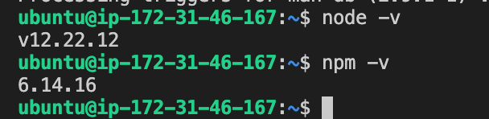

#### Application Code Setup

Do the following steps:
 - Create a new directory for the T0-do project with the code: `mkdir Todo`

 - Run ls command to verify the To-do project directory has been created `ls`

 - Change your directory to the newly created one with `cd Todo`

 - Now use the command `npm init` to initialise your project, so that a new file named `package.json` will be created. This file will normally contain information about your application and the dependencies that it needs to run. Follow the prompts after running the command. You can press Enter several times to accept default values, then accept to write out the package.json file by typing yes

 - Run `ls code to verify `package.json file has been created

 Below shows the snapshot of the application setup code on the terminal:

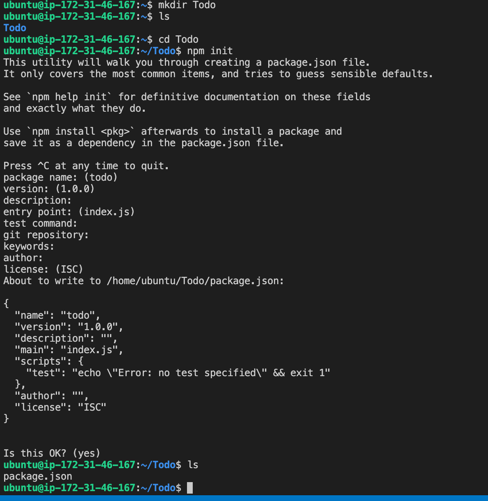

#### INSTALL EXPRESSJS
 Note that express is a framework of node.js and as such a lot of things that developers would have programmmed is taken care of out of the box and as such, it simplifies development.

 Install express using npm:

 `npm install express`

 Create a file called index.js with this command:

 `touch index.js`

 Run ls to confirm that your index.js file is successfully created

 `ls`

 Install  the dotenv module using `npm install dotenv`

 Snapshot of all the code run sofar in my terminal is show in the image below:

 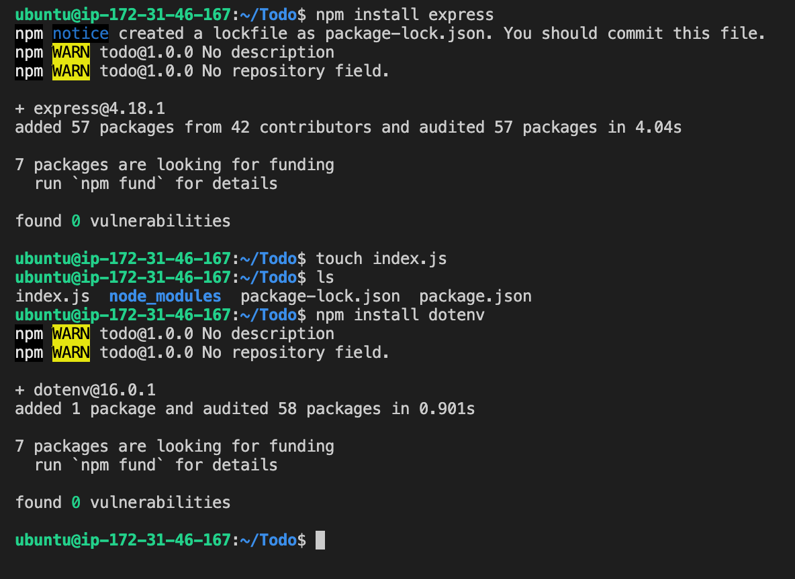

 Open the index.js file with the command `vim index.js` and paste the code below and save:

 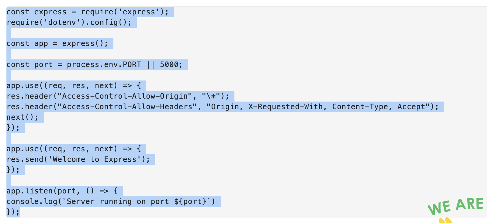

 Notice in the index.js code that we have specified to use port 5000, this will come handy later when we go to the browser

 Now its time to test that the server works. Run the code below in your terminal in the same directory as your index.js file (in this case we are in the Todo folder) :

 `node index.js`

  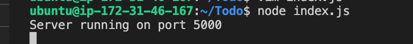

Now, we have to ensure port 5000 is opened up in our EC2 instance from the inbound rules. See snapshot below:

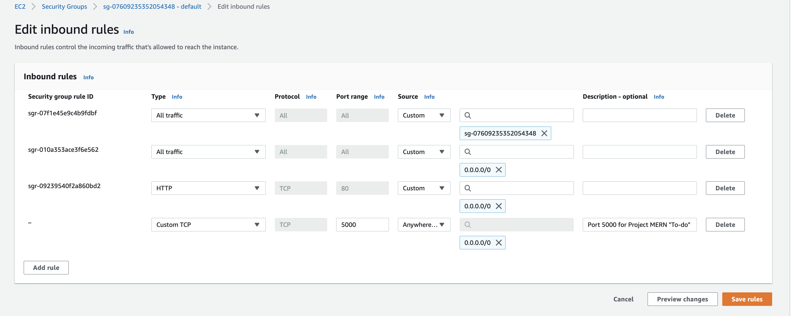

Now put the follwing in your web browser taking care to replce ip4 with the ip address of your EC2 instance:

`http://<PublicIP-or-PublicDNS>:5000`

The browser result is shown below:

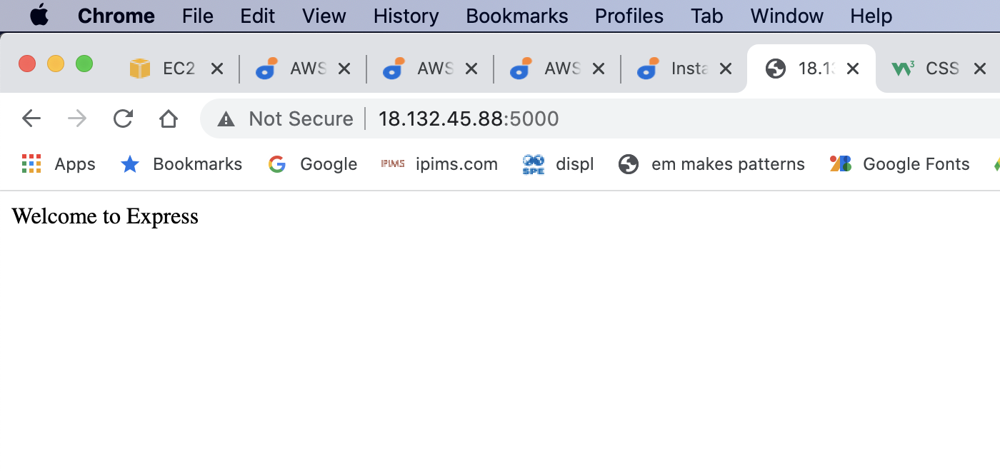
 

 #### Routes

 Our To-Do application is expected to be able to do 3 main things:

    1. Create a new task
    2. Display list of all tasks
    3. Delete a completed task

Each task will be associated with some particular endpoint and will use different standard HTTP request methods: POST, GET, DELETE

For each task, we need to create Routes which will define the various endpoints that the To-do app will depend on. 

 - Start by creating a directory called routes (this is created in Todo directory) 
    `mkdir routes`

- Change directory to routes director using `cd routes`

- Create a file api.js with the command `touch api.js`

- Open the file with this command `vim api.js`

- Paste the following code into the api.js file:

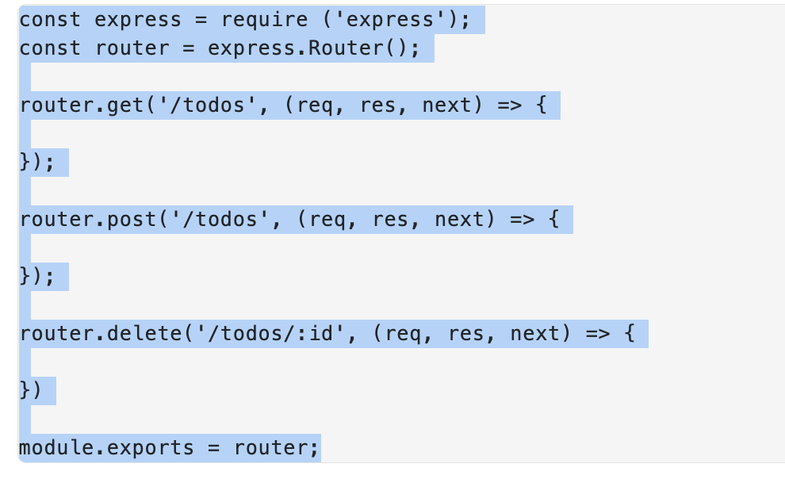

#### Models

As the app is going to make use of Mongodb which is a NoSQL database, we need to create a model.

A model is at the heart of JavaScript based applications, and it is what makes it interactive.

We will also use models to define the database schema . This is important so that we will be able to define the fields stored in each Mongodb document.

In essence, the Schema is a blueprint of how the database will be constructed, including other data fields that may not be required to be stored in the database. These are known as virtual properties

To create a Schema and a model, install mongoose which is a Node.js package that makes working with mongodb easier.

Change directory back Todo folder with cd .. and install Mongoose

`npm install mongoose`

Create a new folder called models

`mkdir models`

Change directory to models

`cd models`

Create a file called todo.js in the models directory

`touch todo.js`

(Tip: all three commands above can be installed in one go with `mkdir models && cd models && touch todo.js`)

Open the file created with `vim todo.js` then paste the code below in the file:

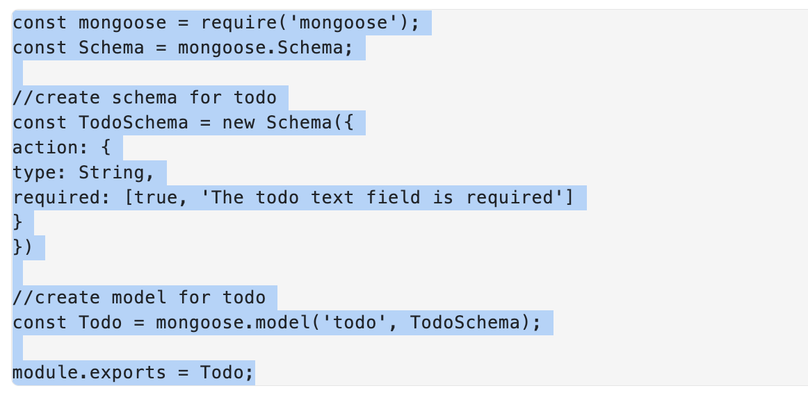

Now we need to update our routes from the file `api.js` in ‘routes’ directory to make use of the new model.

In Routes directory, open `api.js` with `vim api.js`, delete the code inside with `:%d` command and paste the code below into it then save and exit

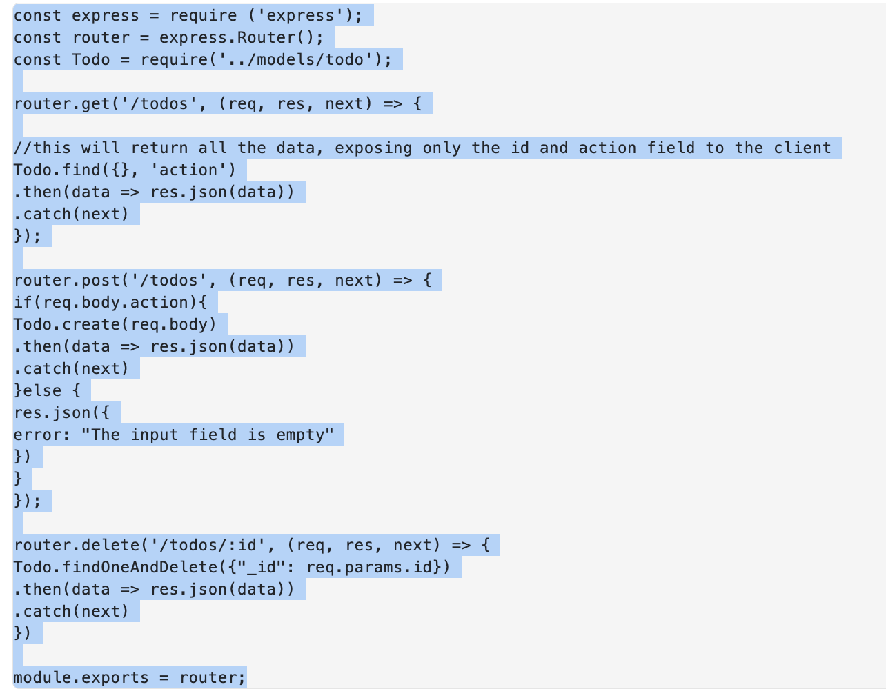

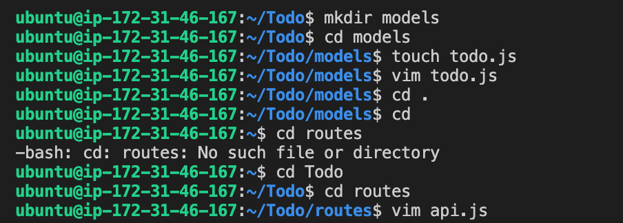

#### MONGODB DATABASE
We will be using mLab which provides MongoDB Databse as a service solution (DBaaS). A free account needs to be created with mLab.

On the MongoDB website, a few things need to be noted when setting up the database:

- When creating your cluster, ensure that you allow access to the MongoDB database from anywhere

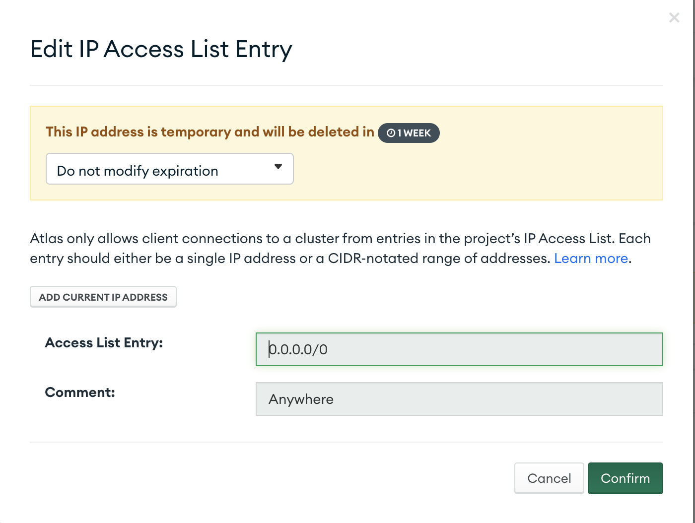

- Ensure that you change the time for deleting the entry from 6 hours to 1 week

In the index.js file, we specified a process.env to access environment variable but this file is yet to be created. The following steps will be used to create the .env file:

- Enter the following code `touch .env` and 
`vi .env`

- The connection string below needs to be pouplated with information relevant to the database and the database user which we just created in MongoDB

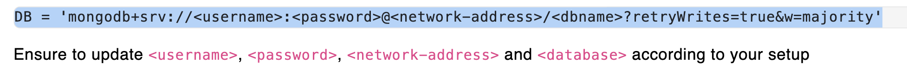

To retrieve network address relevant to my database, see snapshot below:

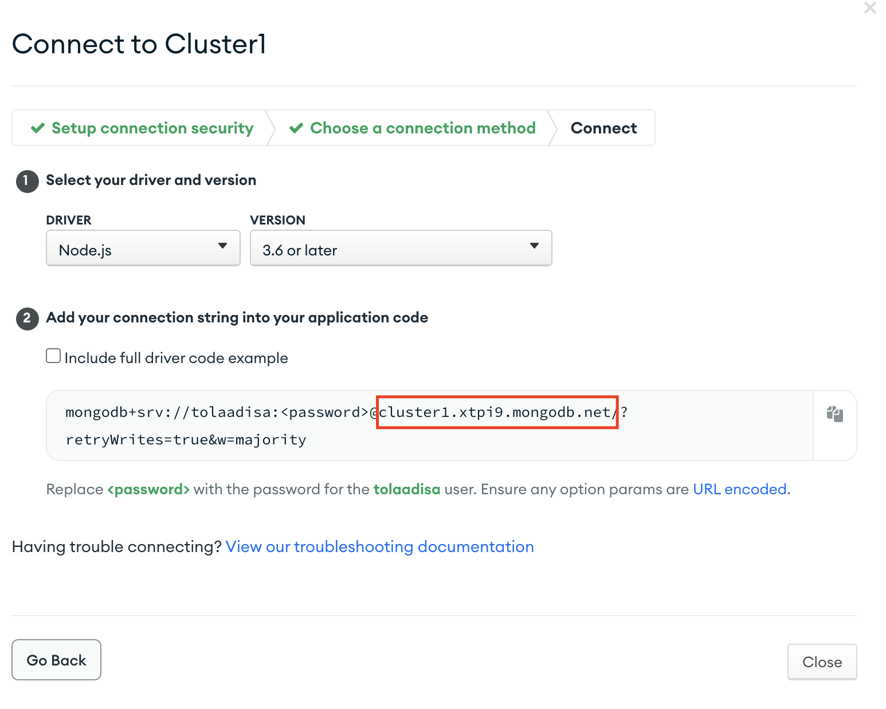

Below is a snapshot of my entry into the .env file in the terminal with key parameters :

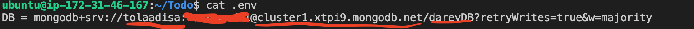

Now the index.js file needs to be updated to reflect the use of .env so that Node.js can connect to the database. 

This is done by using vim to open the index.js file `vim index.js`

Press `esc`, type `:`,  type `%d` and hit enter. This deletes entire content of index.js file

Enter insert mode and then paste the following into the index.js file and save:

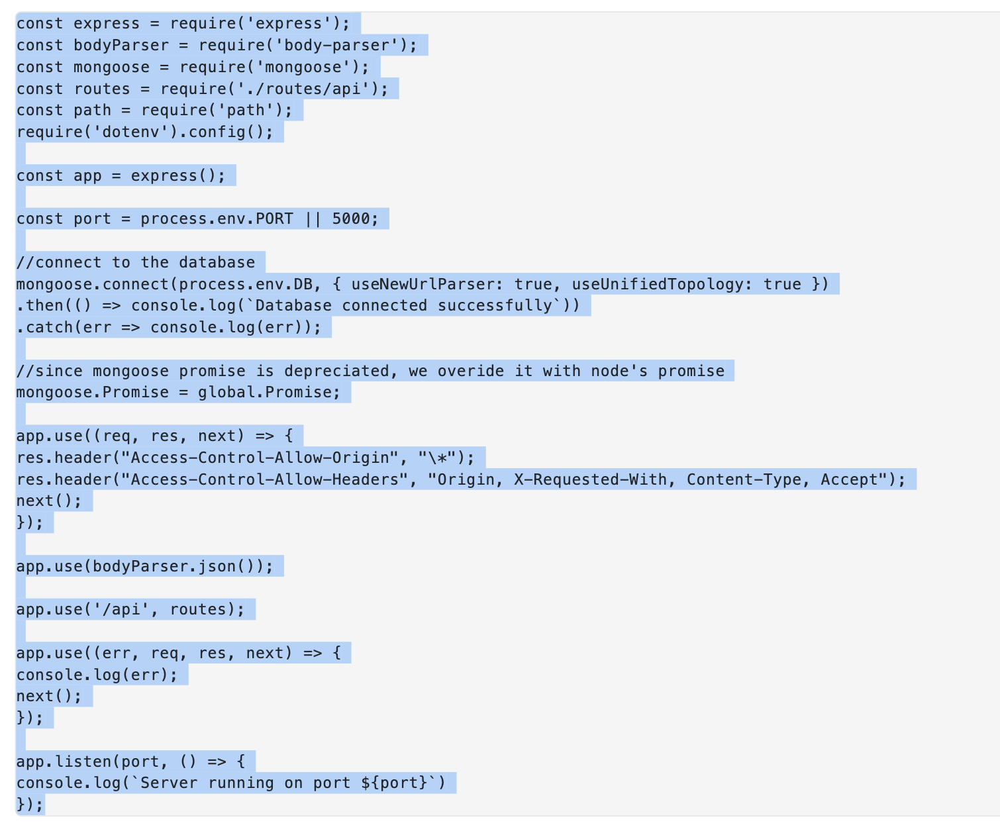

Now you can start the server by entering `node index.js` in the terminal. The result showing a sucessful connection is shown below:

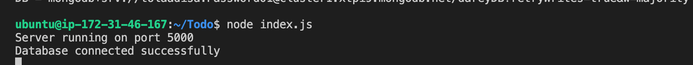

The above shows that the backend has been configured successfully and the next steps will be used to test it.

#### Testing Backend Code without Frontend using RESTful API

Having created the backend and connected a database sucessfully, we are missing a user interface. This UI will be achieved with REACTJS code but during development, we need a way to test our code and this will be achieved using Postman to test our API

- start by downloading the latest version of Postman 
- ReactJS code is needed for the front-end UI which will be used to interact with our database. However, we can use Postman to to test our code using RESTFul API. This is where postman comes in. 
- All API endpoints should be tested to ensure they are working. For endpoints which require body, we will send JSON field back since this is what is in our code. 

In postman, create a POST request to the API using code below. This code will send a new task to our TO-DO list so application can store it in the databse. Note to replace the address below with the IP or DNS address of your EC2 instance 

`http://<PublicIP-or-PublicDNS>:5000/api/todos`

Under the header, ensure key is set to "Content-Type" and Value is set to "Application/Json" as indicated in the snapshot below:

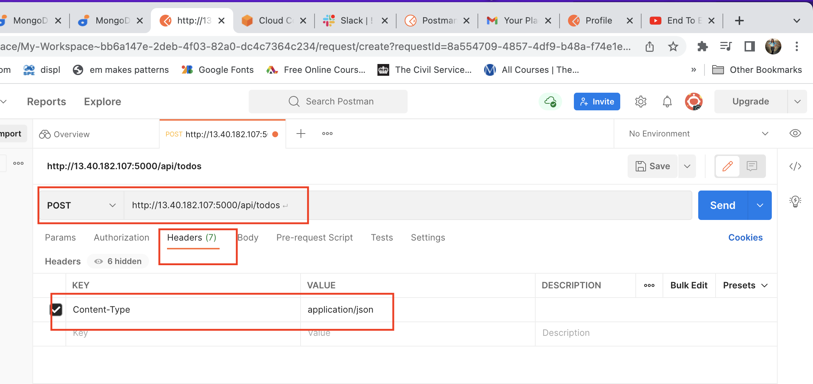

Under the body, ensure  you select "raw" and check that Json is highlighted. Then you enter the code as indicated in the snapshot below:

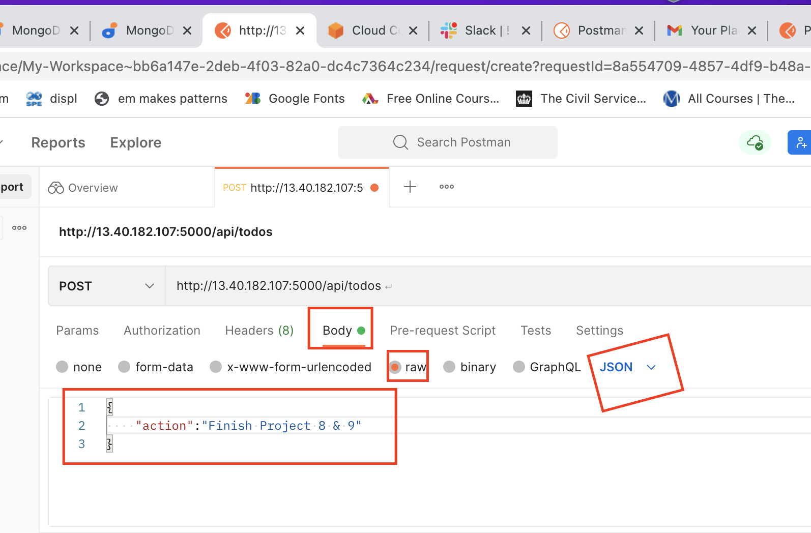

Now, creat a GET operation in postman. This operation retrieves all existing records from the our To-do applicdation (backend requests these records from the database and sends it us back as a response to GET request)

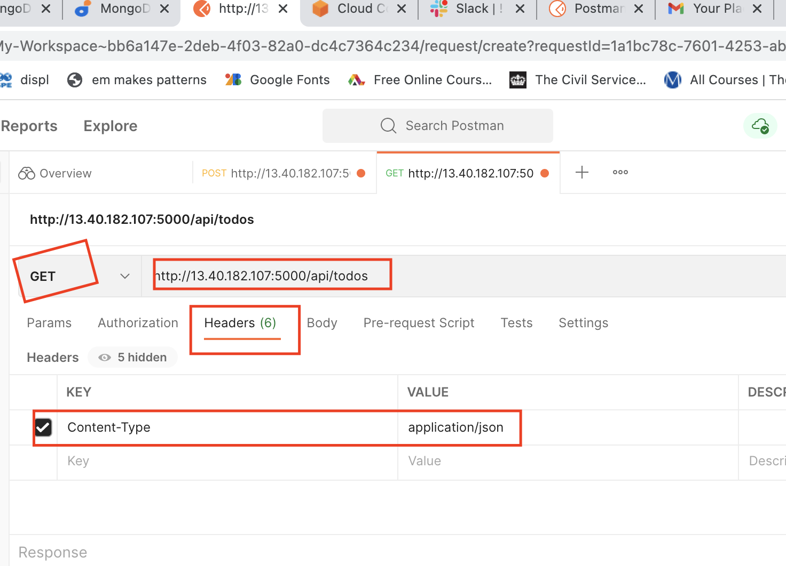

The results after clicking send, the reults from both Get and Post are shown below:

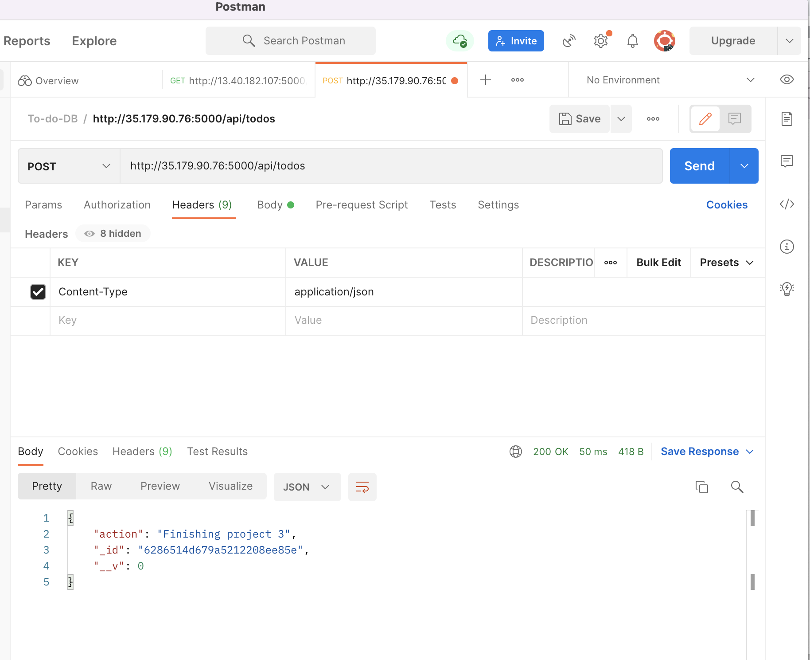

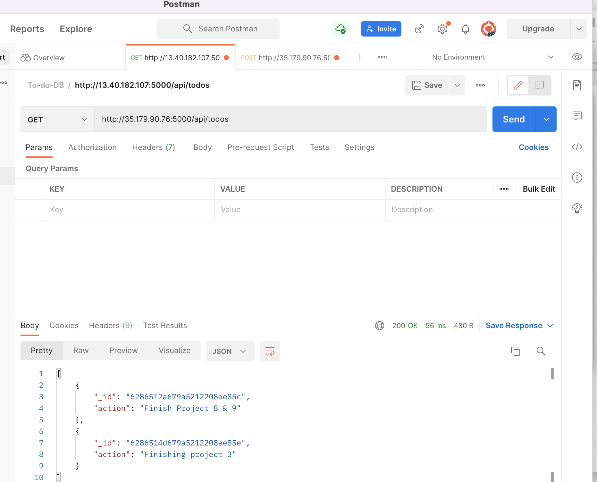

Delete is achieved by opening up another tab and pasting the address in the browser but adding a forward slash and the ID of any message that has been previously sucessfully posted to the app.. see sample result below:

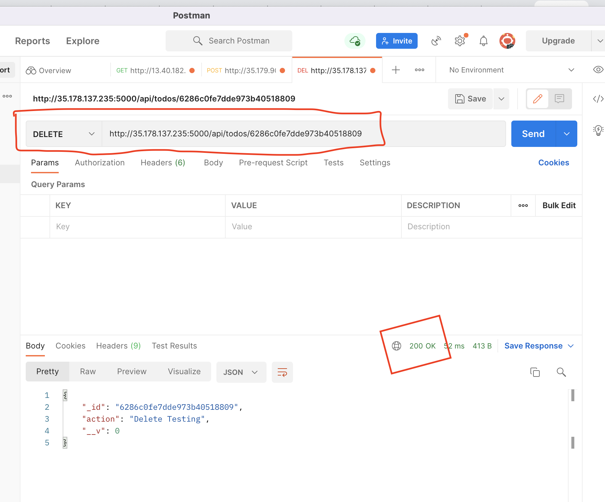

###STEP 2 – FRONTEND CREATION

The following will show to to create the UI interface after testing the backend.

The `create-react-app` command will be used to scaffold our app

Run the following in Todo directory. A new folder called client will be created in the Todo directory

Install the following dependencies before testing the react app:

- Install `concurrently` which is used to run more than one command silultenously from the command line `npm install concurrently --save-dev`

- Install `nodemon`which is used to run and monitor the server `npm install nodemon --save-dev`

- open the package.json file in the Todo folder and modify the scripts section of the code by replacing it with the following:

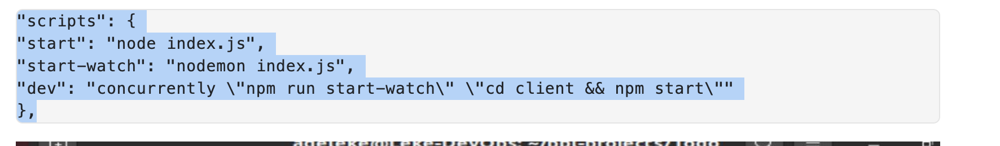

Now you need to configure proxy in package.json. 

Again, open the package.json file and add the following code to it:

"proxy": "http://localhost:5000".

Both modificatinos above are showb below:

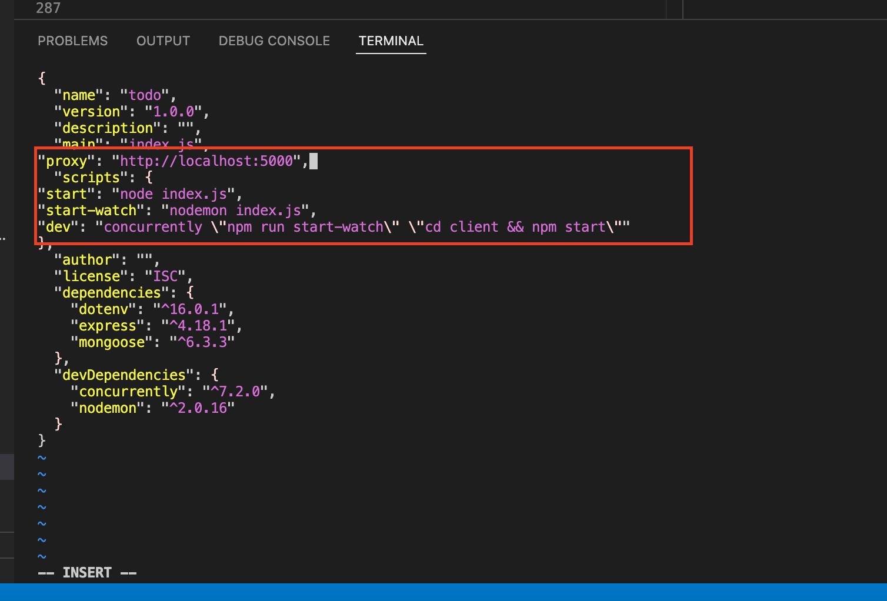

The whole purpose of adding the proxy configuration in number 3 above is to make it possible to access the application directly from the browser by simply calling the server url like http://localhost:5000 rather than always including the entire path like http://localhost:5000/api/todos

Now run the following inside the Todo folder

`npm run dev`

The app should be open and be running on port 3000 as per below. Note to also open up port 3000 on the EC2 instance 

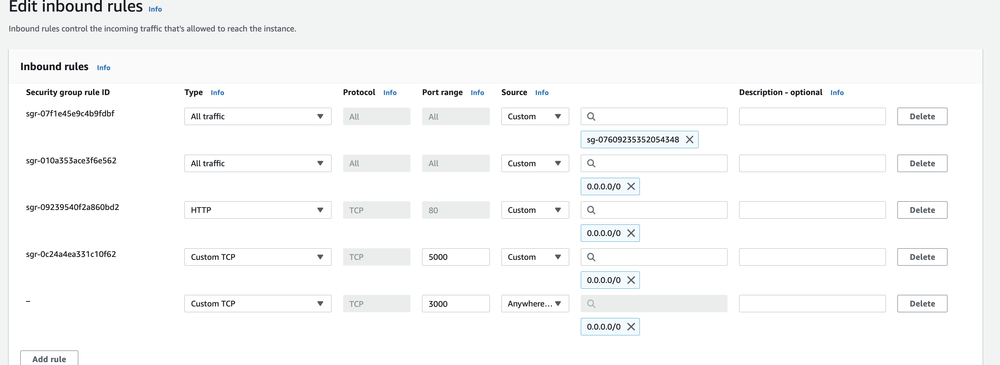

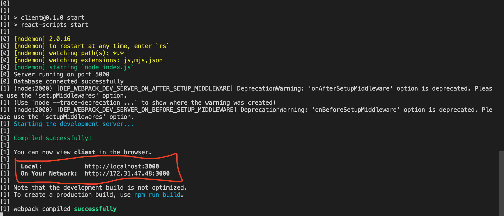

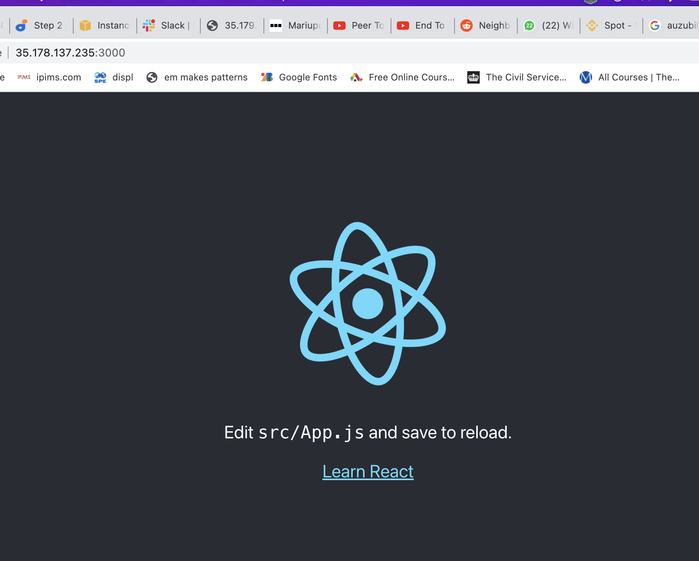

#### Creating your React Components

For our Todo app, there will be two stateful components and one stateless component.
From your Todo directory run the code:

`cd client`

`cd src`

Create a directory inside src folder `mkdir components`

`cd components`
Create the following three files inside newly created components folder:

`touch Input.js ListTodo.js Todo.js`

open input.js and copy/paste the given code into this file

To make use of Axios, which is a Promise based HTTP client for the browser and node.js, you need to cd into your client from your terminal and run yarn add axios or npm install axios.

move to src folder with `cd ..`

move to clients folder with `cd ..` and install Axios in this folder with the code `npm install axios`

Go to the components directory with `cd src/components` and open the ListTodo.js file with `vi ListTodo.js`

Copy and paste the given code into this file and save. 

Then in your Todo.js file you write the given code (note that this file is in the components folder)

We need to make little adjustment to our react code. Delete the logo and adjust our App.js to look like this.

Move to the src folder with `cd ..` and run `vi App.js` then delete what is currently in there and paste the given code. 

In the src directory open the App.css, delete existing code and copy/paste the given code in there

In the src directory open the index.css, delete existing code and copy/paste the given code in there

Now go to the Todo directory with `cd ..`

Once here, run the code `npm run dev` There result from running this code is below:

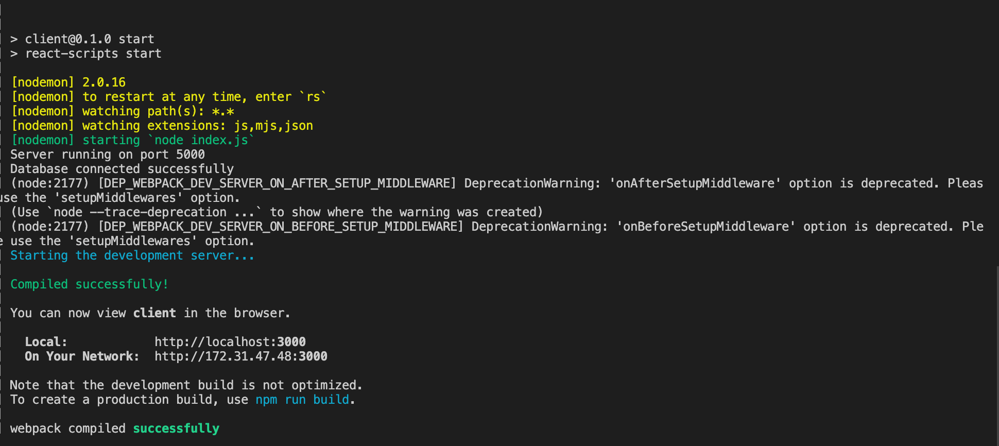

Upon refershing the browser, the app shows up and I can make entries to the app. See snapshot form the finished app below:

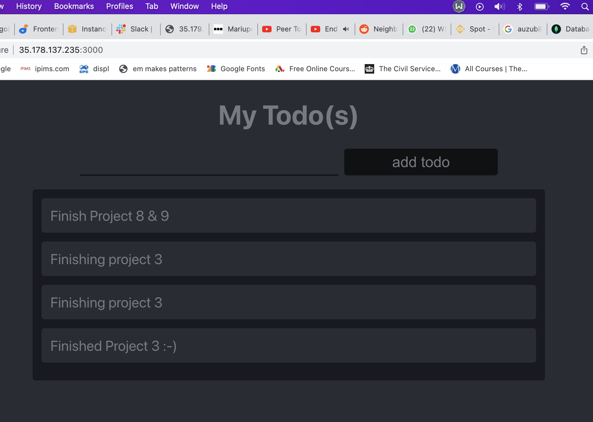

 